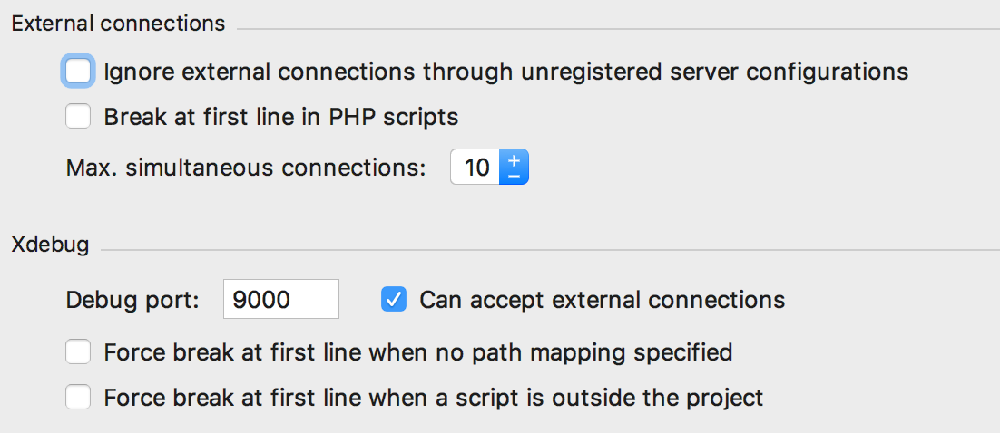
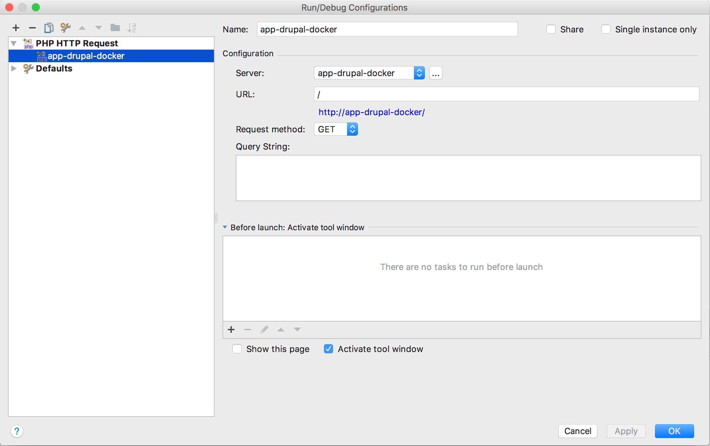
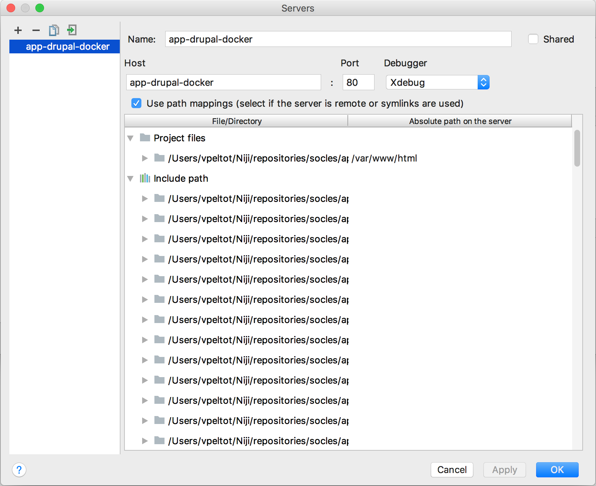
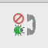

# Configuration Xdebug

## Activer Xdebug dans docker

* Copier le fichier docker-compose-local.yml.dist en docker-compose-local.yml
* S'assurer que les valeurs de `PHP_XDEBUG` et `PHP_XDEBUG_DEFAULT_ENABLE` ont la valeur `1` et que `PHP_XDEBUG_REMOTE_CONNECT_BACK` à la valeur `0`
* Faire au minimum un `make start` afin de recréer le conteneur PHP.
* Xdebug est maintenant activé.

## Configurer PHP Storm

* Aller dans les préférences de PHPStorm (`⌘,` / `Ctrl + Alt + s`)
* `Languages & Frameworks` > `PHP` > `Debug`
* Configurer comme ceci :

* Aller dans la configuration du debug (`Run` > `Edit configurations`)
* Ajouter une configuration (`+` > `PHP Web Page`)
  * `Name` : Renseigner le nom de cette configuration, valeur libre.
  * `Server` : Cliquer sur `...` pour ajouter un serveur
    * `Name` : ATTENTION, ce champ doit avoir pour valeur la même valeur que la variable `APP_DOMAIN` du fichier `.env`
    * `Host` : Correspond au nom d'hôte de ce serveur.
    * `Use path mappings` : Doit être coché et l'`absolute path on the server` pour le `project path` doit être `/var/www/html`
    * Enregistrer les changements
  * Enregistrer les changements

#### Exemples de configuration
##### Debug Config

##### Server config

  
## Lancer un debug

* Cliquer sur l'icône  pour démarrer l'écoute.
* Placer un point d'arrêt (exemple au début du fichier `index.php` pour tester que tout fonctionne)
* Afficher une page
* Le debugger doit se lancer

## FAQ

* Le debugger se lance lorsque j'exécute une commande Drush :
  * Ne pas oublier de décocher les 2 lignes `Force break at first line ...` dans les préférences PHPStorm 

